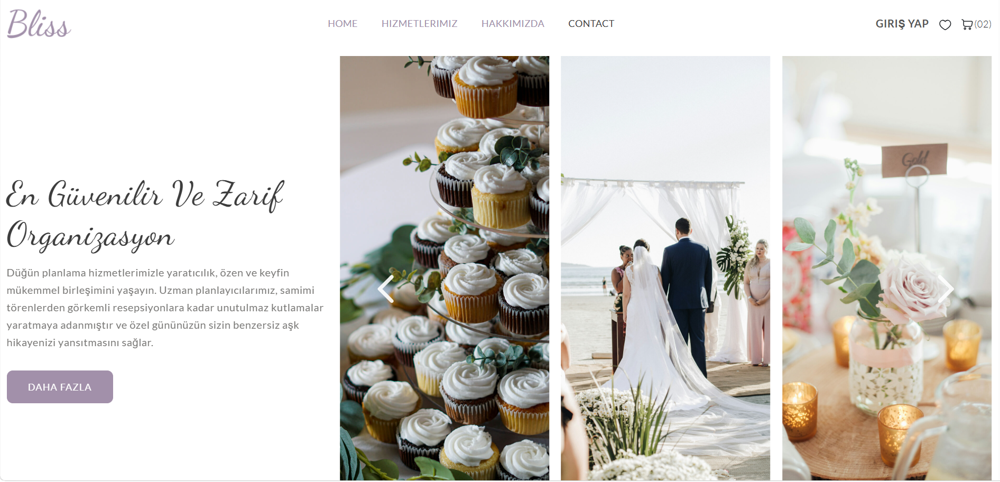
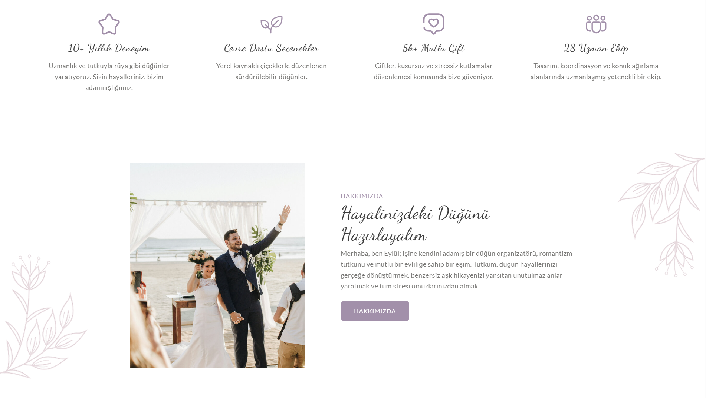
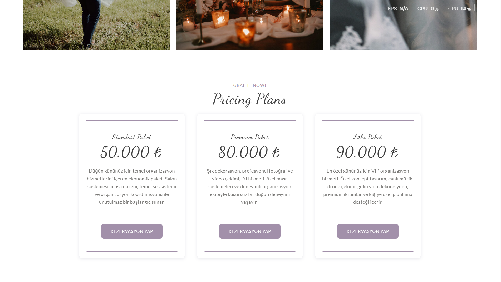
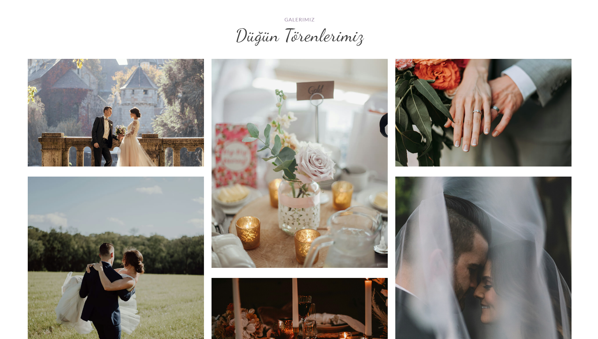
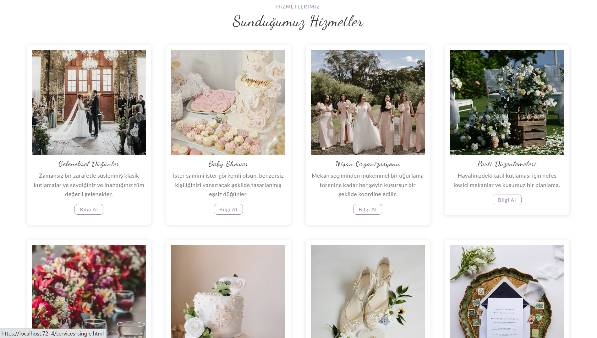
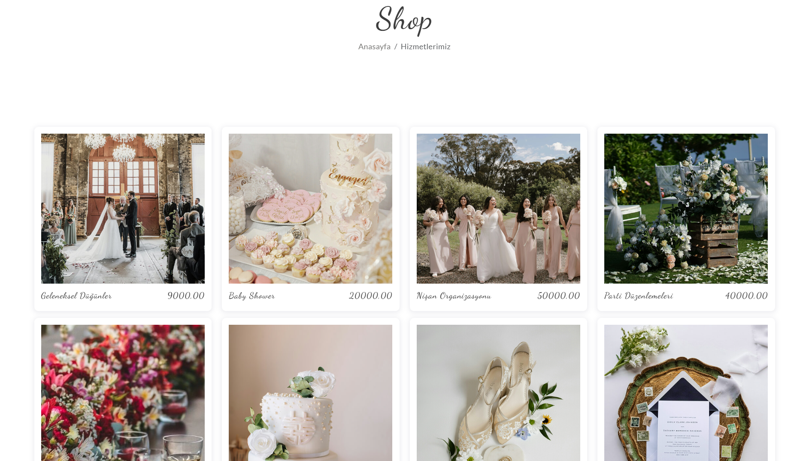
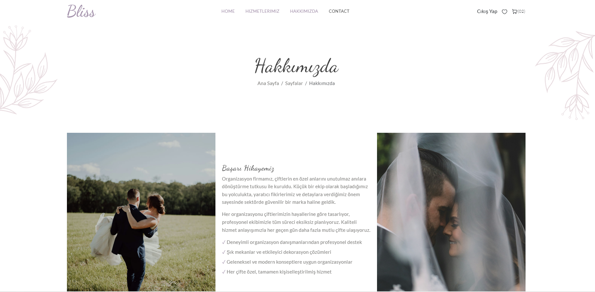
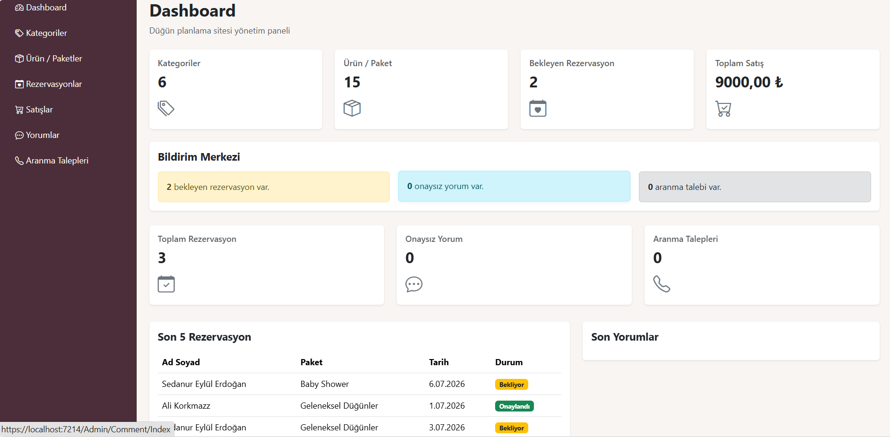
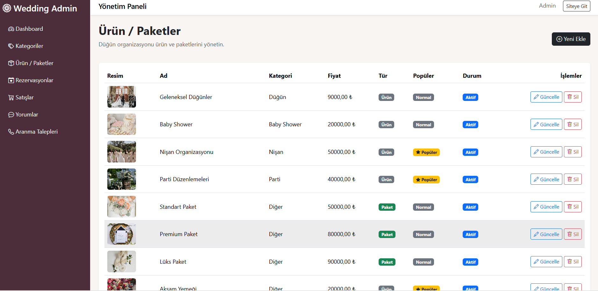
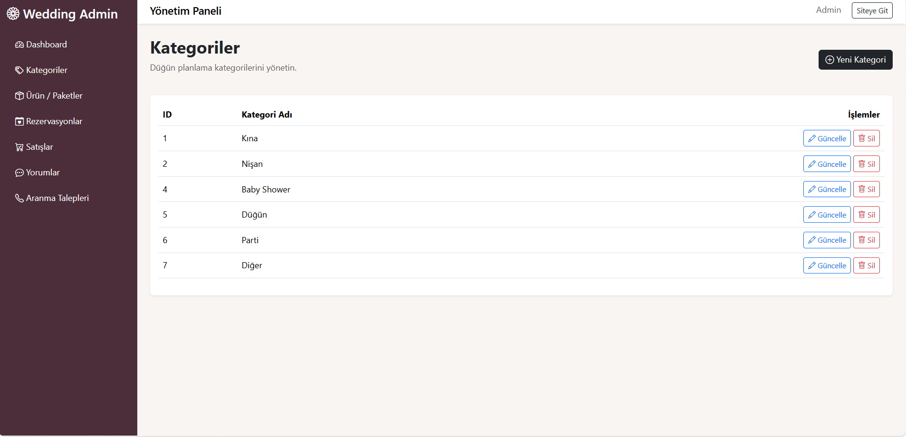

<!-- HEADER -->
<div align="center">

# 💍 Bliss Event Planner

### Premium Wedding & Event Planning Management System with ASP.NET Core MVC

A modern wedding and event planning platform built using ASP.NET Core MVC, Entity Framework Core, ASP.NET Identity, SQL Server and Bootstrap. The project provides a complete management system for wedding organizations, engagement ceremonies, henna nights, event packages, reservations, customer accounts, and an administrative dashboard.

---


</div>

---

# 📸 Project Screenshots

## Home Page



---

## Home Banner



---

## Featured Packages



---

## Gallery Section



---

## Package Listing



---

## All Packages



---

## About Us



---

## Admin Dashboard



---

## Package Management



---

## Category Management



---
# 🚀 Project Features

### 💍 Customer Side

- **Modern Home Page:** Elegant landing page with responsive wedding design and smooth animations.
- **About Us:** Company introduction, experience, vision and service presentation.
- **Wedding & Event Packages:** Dynamic listing of wedding, engagement, henna, proposal and organization packages.
- **Package Details:** Detailed information, pricing, images and package descriptions.
- **Online Reservation System:** Customers can easily create reservation requests for selected packages.
- **Secure Authentication:** Registration, login and logout with ASP.NET Identity.
- **Role-Based Authorization:** Different interfaces for administrators and customers.
- **Responsive Interface:** Mobile-friendly Bootstrap design compatible with all devices.

---

### 🛠 Admin Panel

- **Dashboard:** Displays total users, reservations, packages and categories with statistic cards.
- **Package Management:** Add, edit, delete and update event packages.
- **Category Management:** Manage organization categories.
- **Reservation Management:** Review and manage customer reservations.
- **User Management:** Identity-based user and role management.
- **Content Management:** Easily manage website content.

---

# 🏗 Project Architecture

```text
10-BlissEventPlanner
│
├── WeddingPlannerProject.Model
│   ├── Entities
│   ├── ViewModels
│   └── Identity Models
│
├── WeddingPlannerProject.Data
│   ├── DbContext
│   ├── Entity Configurations
│   ├── Repository
│   ├── Unit Of Work
│   └── Migrations
│
└── WeddingPlannerProject.UI
    ├── Areas
    │   ├── Admin
    │   └── User
    ├── Controllers
    ├── Views
    ├── ViewComponents
    ├── wwwroot
    └── Program.cs
```

---

# 🛠 Technologies

| Backend | Frontend | Database | Other |
|----------|----------|----------|--------|
| ASP.NET Core MVC | Bootstrap 5 | SQL Server | Entity Framework Core |
| ASP.NET Identity | HTML5 | Code First | LINQ |
| C# | CSS3 | LocalDB | Repository Pattern |
| Razor Pages | JavaScript | Migration | Unit Of Work |
| Dependency Injection | jQuery | | Session Management |
| Authentication | AJAX | | Authorization |
| View Components | Responsive Design | | Font Awesome |
| Areas | SweetAlert | | Bootstrap Icons |

---

# 📊 Modules

✔ Home Page

✔ About Us

✔ Wedding & Event Packages

✔ Package Details

✔ Online Reservation System

✔ Reservation Management

✔ Customer Registration

✔ Customer Login

✔ ASP.NET Identity Authentication

✔ Role-Based Authorization

✔ Admin Dashboard

✔ Package CRUD

✔ Category CRUD

✔ User Management

✔ Session Management

✔ Responsive UI

✔ View Components

✔ Modern Wedding Theme

---

# 📂 Database Tables

| Table | Description |
|---------|-------------|
| AppUsers | Stores customer and administrator accounts. |
| Categories | Stores event categories. |
| ProductPackages | Stores wedding and event packages. |
| Reservations | Stores customer reservation requests. |
| Comments | Stores customer reviews and feedback. |
| Contacts | Stores contact form messages. |
| AspNetUsers | Identity user accounts. |
| AspNetRoles | Identity roles. |
| AspNetUserRoles | User-role relationships. |
| AspNetUserClaims | User claims. |
| AspNetRoleClaims | Role claims. |
| AspNetUserLogins | External login information. |
| AspNetUserTokens | Identity authentication tokens. |

---

# 🎯 Learning Outcomes

- ASP.NET Core MVC Application Development
- Entity Framework Core Code First
- ASP.NET Identity Authentication & Authorization
- Role-Based Access Control
- Repository Pattern
- Unit Of Work Pattern
- Dependency Injection
- CRUD Operations
- LINQ Queries
- Session Management
- Bootstrap Responsive Design
- Razor View Engine
- Areas Structure
- View Components
- Authentication & Authorization
- Form Validation
- Dashboard Development
- SQL Server Database Management

---

# ⭐ Project Status

✅ Completed

---

<div align="center">

Made with ❤️ using ASP.NET Core MVC, Entity Framework Core & ASP.NET Identity

</div>
